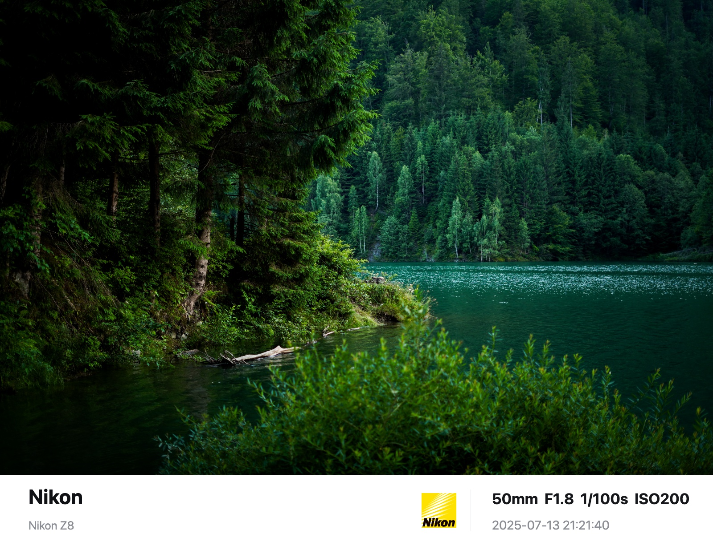
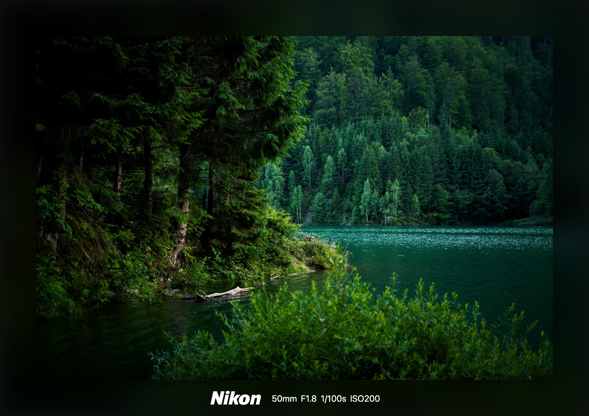
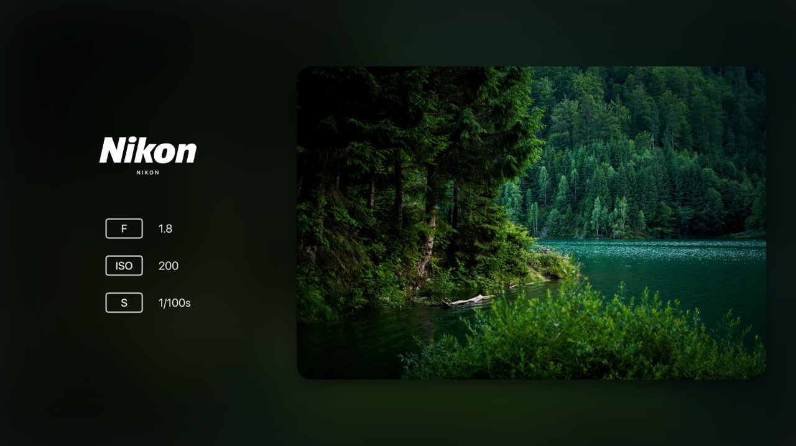

<p align="center">
  
</p>

<h1 align="center">Photo Border</h1>

<p align="center">
  一个用于给照片生成相机信息边框的 PWA 应用。上传照片后，应用会尽量读取 JPEG EXIF 信息，并把品牌、设备、拍摄参数和时间渲染到可导出的成片中。
</p>

## 功能

- 支持单张或多张图片上传。
- 支持读取 JPEG EXIF，自动填充品牌、设备、参数和拍摄时间。
- 支持手动编辑边框文字信息。
- 支持品牌 Logo 匹配、图标样式选择和 Logo 大小调整。
- 支持模板切换，并按当前模板显示所需设置项。
- 支持导出当前照片或批量导出全部照片。
- 预览和导出共用 Canvas 渲染逻辑，尽量保证所见即所得。

## 模板示例

| 纯白铭牌 | 柔焦光影框 | 光影侧栏 |
| --- | --- | --- |
|  |  |  |

## 技术栈

- React 19
- TypeScript
- Vite
- Canvas 2D
- pnpm

## 本地开发

先安装依赖：

```bash
pnpm install
```

启动开发服务器：

```bash
pnpm dev
```

生产构建：

```bash
pnpm build
```

代码检查：

```bash
pnpm lint
```

预览生产构建：

```bash
pnpm preview
```

## 使用方式

1. 打开应用后上传一张或多张照片。
2. 选择需要使用的边框模板。
3. 根据当前模板显示的设置项调整 Logo、文字、边框宽度或模板专属参数。
4. 点击“导出当前”导出当前照片，或点击“批量导出全部”导出队列中的全部照片。

## 项目结构

```text
src/
  App.tsx                    应用状态、上传、导出和控制面板
  components/CanvasPreview.tsx
                             Canvas 预览组件
  templates/                 边框模板和导出渲染逻辑
  brand/                     品牌识别和 Canvas Logo 绘制
  lib/                       EXIF、图片加载、颜色等工具
  data/                      默认数据和品牌选项
public/
  camera-logos/              品牌 Logo 静态资源
  example/                   模板示例图
```

## 资源来源

`public/camera-logos/` 中的品牌图标文件来自 [Camera-Logos-SVG](https://github.com/HiSeatown/Camera-Logos-SVG) 项目。

## 新增模板

新增模板时建议放在 `src/templates/` 下，并导出一个 `TemplateDefinition`：

- `id`、`name`、`description` 用于模板选择列表。
- `controls` 声明该模板需要显示哪些设置项。
- `drawExport` 负责 Canvas 渲染，预览和导出都会调用它。
- 如果模板会改变导出画布宽度，可以实现 `getCanvasWidth`。

最后在 `src/templates/index.ts` 中注册新模板。

## 仓库

GitHub: <https://github.com/Pylogmon/photoBorder>
